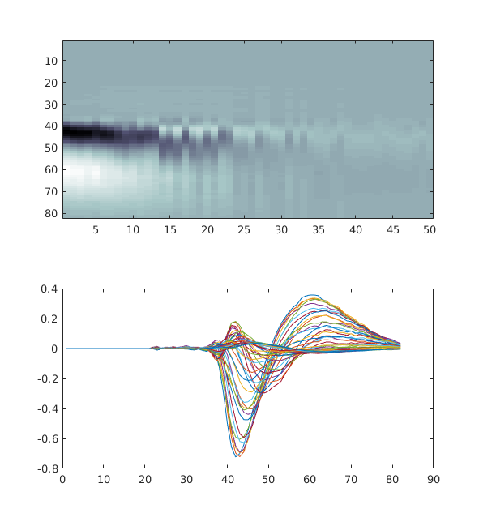

# ONE Tutorial Matlab

Before you begin, make sure you have installed ibllib properly on your system as per the previous instructions.

## Create ONE object

Once the One class is instantiated and setup, we can create an **one object** (here labelled `one`). 

### With default connection settings

Type in Matlab prompt: 

```matlab
one = One();  % this line of code will be the first line to write everytime you re-open Matlab
```

**_Reminder_**: connection parameters inserted via `one.setup` will modify the JSON `.one_params` file [see installation notes here](one_matlab_installation)


### With different connection settings for single time use

For this tutorial we will be connecting to a **test database** with a **test user**. As these credentials will be used for this tutorial only, we do not want to change the base parameters of the JSON `.one_params` file.

To change the credentials without changing the JSON `.one_params` file, type:
```matlab
one = One(	'alyx_login', 'test_user', ...
			'alyx_pwd', 'TapetesBloc18', ...
			'alyx_url', 'https://test.alyx.internationalbrainlab.org');
```

You now have created an one object. This object has several fields, the following are of interest for analysis. Type help to retrieve the documentation on each field:
```matlab
help one.list
help one.load
help one.search
```

## Find an experiment

Each experiment is identified by a unique string known as the "experiment ID" (EID). To find an EID, use the `one.search` command.


The following example shows how to find the experiment(s) performed by the user `olivier`, on the 24 Aug 2018:

```matlab
[eid, ses] = one.search('users', {'olivier'}, 'date_range', datenum([2018 8 24 ; 2018 8 24])) ;
```
returns
```matlab
eid =
    'cf264653-2deb-44cb-aa84-89b82507028a'
```
The searchable fields are listed by calling the search method with no parameters:
```matlab
one.search

% Example search keywords: 
	'dataset_types'
	'date_range'
	'labs'
	'subjects'
	'users'
```

## List method
Once you know the EID, you can list all the datasets for the experiment using the list command:
```matlab
one.list(eid)
``` 
returns
```matlab
ans =

  29×1 cell array

    {'_ibl_lickPiezo.raw'        }
    {'_ibl_lickPiezo.timestamps' }
    {'_ibl_wheel.position'       }
    {'_ibl_wheel.timestamps'     }
    {'channels.brainLocation'    }
    {'channels.probe'            }
    {'channels.rawRow'           }
    {'channels.site'             }
    {'channels.sitePositions'    }
    {'clusters._phy_annotation'  }
    {'clusters.depths'           }
    {'clusters.peakChannel'      }
    {'clusters.probes'           }
    {'clusters.templateWaveforms'}
    {'clusters.waveformDuration' }
    {'eye.area'                  }
    {'eye.blink'                 }
    {'eye.timestamps'            }
    {'eye.xyPos'                 }
    {'licks.times'               }
    {'probes.description'        }
    {'probes.insertion'          }
    {'probes.rawFilename'        }
    {'probes.sitePositions'      }
    {'spikes.amps'               }
    {'spikes.clusters'           }
    {'spikes.depths'             }
    {'spikes.times'              }
    {'spontaneous.intervals'     }
```

For more detailed datasets info, this command will return a dataclass with `dataset_type`, `data_url` and `dataset_id` fields amongst others:
```matlab
[dtypes details] = one.list(eid);
details = 

  struct with fields:

              id: {29×1 cell}
            name: {29×1 cell}
    dataset_type: {29×1 cell}
        data_url: {29×1 cell}
     data_format: {29×1 cell}
             url: {29×1 cell}
             eid: {29×1 cell}

```
To get the full contextual information about the session, get all fields:
```matlab
ses_info = one.list(eid, 'keyword', 'all')
```

To navigate further the database, it may be useful to get the range of possible keywords values to search for sessions.
For example to print a list of the dataset-types, users and subjects in the command window:
```matlab
one.list([],'keyword', 'labs')
one.list([],'keyword', 'datasets')
one.list([],'keyword', 'users')
one.list([],'keyword', 'subjects')
```

## Load method
### General Use

To load data for a given EID, use the `One.load` command:

```matlab
dataset_types = {'clusters.templateWaveforms', 'clusters.probes', 'clusters.depths'};
eid = 'cf264653-2deb-44cb-aa84-89b82507028a';
[wf, pr, d ]= one.load(eid, 'data' ,dataset_types);

figure,
imagesc(squeeze(wf(1,:,:)), 'Parent', subplot(2,1,1)), colormap('bone')
plot(subplot(2,1,2), squeeze(wf(1,:,:)))
```



Depending on the use case, it may be handier to wrap the arrays in a dataclass
(a structure for Matlab users) so that a bit of context is included with the array. This would be useful when concatenated information for datasets belonging to several sessions.

```matlab
D = one.load(eid, 'data' ,dataset_types, 'dclass_output', true);

disp(D.local_path)
disp(D.dataset_type)
disp('dimensions: ')
disp(cellfun(@(x) length(x), D.data))
```
will print in the command window the following: 
```matlab
    '/home/owinter/Downloads/FlatIron/mainenlab/Subjects/clns0730/2018-08-24/1/clusters.templateWaveforms.5e7f6ede-2618-41d2-95ee-ce144ea12851.npy'
    '/home/owinter/Downloads/FlatIron/mainenlab/Subjects/clns0730/2018-08-24/1/clusters.probes.c41dd877-d511-42cb-90a3-01bb19297117.npy'
    '/home/owinter/Downloads/FlatIron/mainenlab/Subjects/clns0730/2018-08-24/1/clusters.depths.42507ace-1ced-4358-a5ef-c4ddd8b7071c.npy'

    'clusters.templateWaveforms'
    'clusters.probes'
    'clusters.depths'

dimensions: 
        1109
        1109
        1109
```
The dataclass contains the following keys, each of which contains a list of 3 items corresponding the the 3 queried datasets

-   data `cell(*array*)`: the array
-   dataset_id `cell(*str*)`: the UUID of the dataset in Alyx
-   local_path `cell(*str*)`: the local full path of the file
-   dataset_type `cell(*str*)`: as per Alyx table
-   url `cell(*str*)`: the link on the FlatIron server
-   eid `cell(*str*)`: the session UUID in Alyx

It is also possible to query all datasets attached to a given session, in which case
the output has to be a table/structure as seen above:

```matlab
[eid, ses_info ]= one.search('subjects', 'flowers');
D = one.load(eid);
```
In this case it will return a table with 5 datasets.

### Specific cases
If a dataset type queried doesn't exist or is not on the FlatIron server, an empty list
is returned. This allows to keep the proper order of output arguments
```matlab
eid = 'cf264653-2deb-44cb-aa84-89b82507028a';
dataset_types = {'clusters.probes', 'thisDataset.IveJustMadeUp', 'clusters.depths'};
[t, empty, cl ] = one.load(eid, 'data', dataset_types)
isempty(empty) % true !
```
Returns an empty array for `empty` so that `t` and `cl` still get assigned the corresponding datasets values.


## Search method
The search methods allows to query the database to filter the list of UUIDs according to
the following fields:
-   `dataset_types`
-   `users`
-   `subject`
-   `date_range`

### One-to-one matches: subjects
This is the simplest case that queries EEIDs (sessions) associated with a subject. There can only
be one subject per session.

```matlab
eid = one.search('subject', 'flowers');
```

Another use case is to query EEIDs associated with a dataset type. 
```matlab
[eids,ses] = one.search('data', 'channels.brainLocation')
```

Here is the simple implementation of the filter, where we query for the EEIDs (sessions) co-owned by
all of the following users: olivier and niccolo (case-sensitive).
```matlab
eid = one.search('users',{'test_user', 'olivier'});
```

The following would get all of the dataset for which olivier is an owner or a co-owner:
```matlab
[eid, ses_info] = one.search('users', 'olivier');
```
Note that unlike the first example, here we used an optional second output argument , to get all context information about the returned sessions.


It is also possible to filter sessions using a `date-range`:
```matlab
eid = one.search('users','olivier', 'date_range', ['2018-08-24'; '2018-08-24'])
```
In the example above we used strings to specify the date however it is a safer practice to cast the range as a 2 elements datenum vector.
```matlab
drange = datenum(['2018-08-24'; '2018-08-24'])
eid = one.search('users','olivier', 'date_range', drange)
```